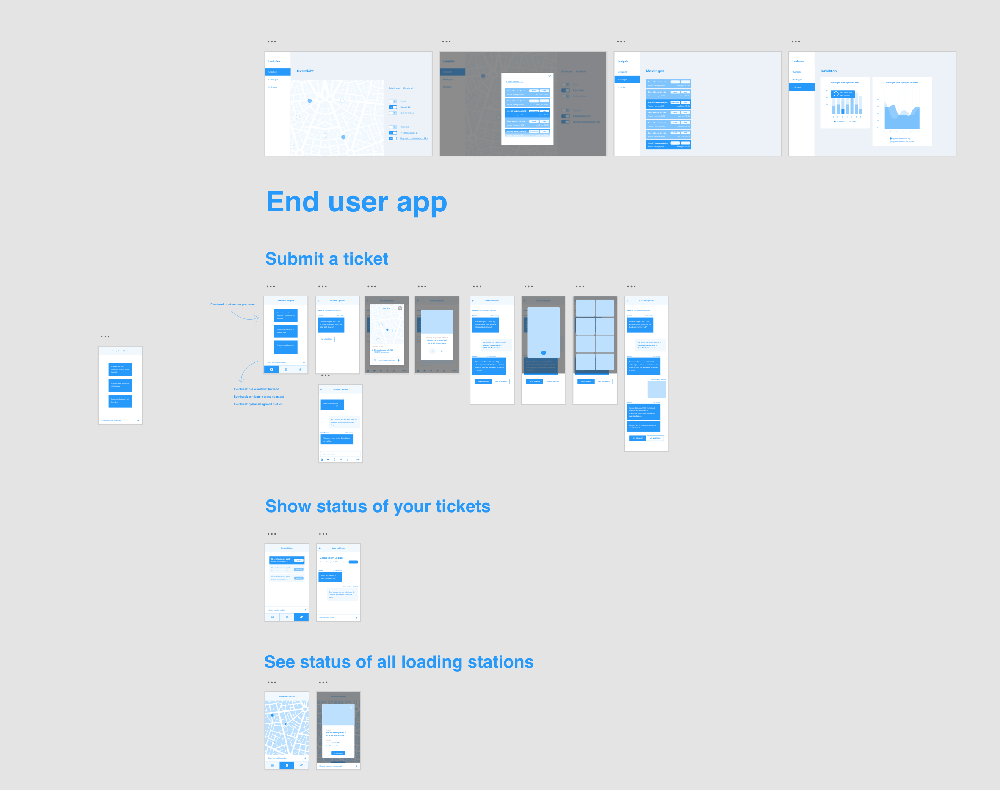
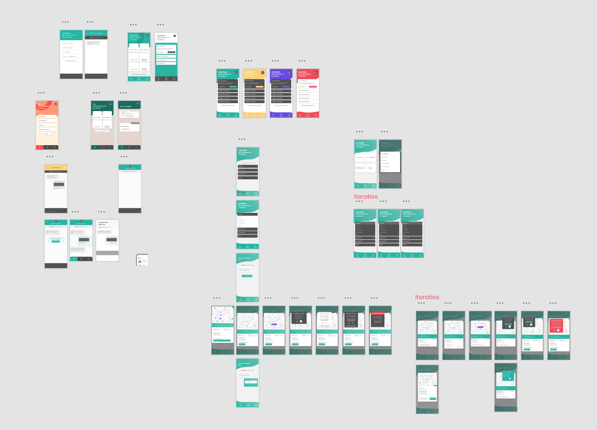
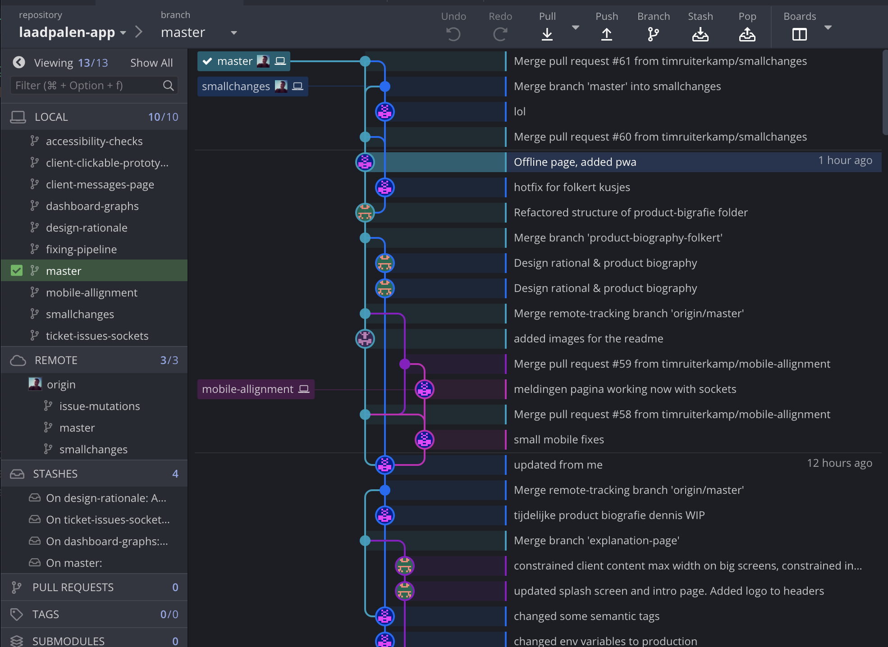
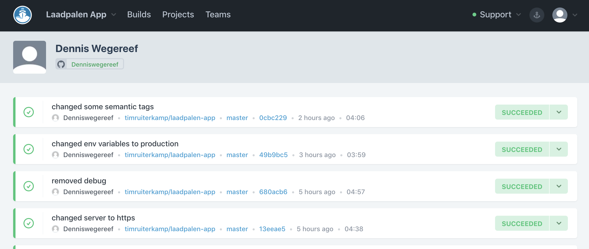

# Product biografie

## Introductie

Mijn productbiografie hoe het process van de afgelopen 5 weken van de Meesterproef is gegaan. Wij hebben een product gemaakt voor Islaad genaamd Recharge.

## Week 1 - Concepting and prototyping

De eerste week zijn we begonnen met de debrief van Jurjen. Over de case waar we uiteindelijk verder zijn ingedoken.

De eerste week hebben Folkert-Jan en ik een user experience prototype gemaakt waarvan we dachten hoe het ongeveer moest werken.

Het idee was al heel snel duidelijk dat je makkelijk een melding zou maken en daarbij vanuit de operator snel terugkoppeling zou hebben wat er met je melding op dat moment zou moeten gebeuren. Hieronder een foto van de eerste flow en de online klikbaar prototype is te vinden hier: [client app wireframes](https://xd.adobe.com/view/200df57a-f938-47e7-62e4-16f374a24c3d-563c/)



Uiteindelijk zijn we deze gaan testen en met de klant en eigenlijk was die al best wel snel tevreden. De toevoeging van het Dashboard was een mooie toevoeging in het concept. Hier wouden we ook de focus op leggen wan het is minstens net zo belangrijk als de app voor de gebruiker.

We wouden het gelijk goed doen en een echte 'CMD-methodiek' aanhouden. Door eerst alles goed op papier te hebben en daarna beginnen met bouwen dat we niet achteraf achter dingen komen waar we totaal niet over hadden nagedacht. Dus het process dat we wouden was eerst wireframen -> visual -> compontenten maken -> in elkaar zetten qua techniek -> laatste puntjes op de I.

Paralel daar aan ben ik begonnen met een beetje begonnen met het design. Niet direct de intentie van de minor maar het moet wel gewoon gebeuren. Ik ben er zelf niet zo heel fan van maar ik vond het wel tof om het op mij te pakken. De designs kunnen gevonden worden [hier](https://xd.adobe.com/view/d8fefb67-82e1-4668-4793-bfec8d2599a8-aecf/). Ik ben zeer tevreden over wat ik gemaakt heb en het is leuk om te zien dat uiteindelijk alles ook gebruikt wordt.

## Week 2 - Prototyping and design

We zijn verder gegaan met het ontwerp en de feedback gepitched bij Jurjen. Hij vond het tof dat we ook het dashboard er in hadden gedaan. Verder waren we goed op weg en hij miste nog wel een beetje het snel klikken van vragen. Dat idee hebben van Robin en Jim geleend en daarop hebben we onze eige variatie gemaakt.

Folkert-Jan van der Pol en ik hebben gezeten met Joop en Matthias van de visual minor om te kijken of er nog kleine dingetjes aangepast konden worden. Hier kwamen een aantal inzichten naar boven.

- Je bent natuurlijk op je telefoon bezig dus er is niet zoveel ruimte, en het volledige scherm gebruiken
- Maar ook veel positieve reacties dat alle components er goed uitzagen en een consistentie vormen

Aansluitelijk van de feedback hebben we gekeken hoe we voor de gebruikers op de telefoon alles een tikkeltje kunnen vergroten.

Herbij alle schermen dat we hebben gemaakt, links zijn allemaal samples om te kijken of we een leuke stijl konden vinden en rechts zijn we verder gegaan met het uiteindelijke resultaat.



Aan het eind van de week hebben we de repository opgezet, gezamelijk hebben Folkert en ik gekeken wat we nou eigenlijk allemaal willen. Daarop hebben we een folder structuur gemaakt en gekeken hoe we alle CSS and JavaScript willen gebruiken en welke code standards.

We hebben gekozen om SASS te gebruiken waarop we variablen en mixins in globale variabelen hebben gezet. Daarop zijn ze makkelijk in alles te bereiken. Ook waren we van mening dat alles in components opgebouwd moest worden. Zo kunnen we makkelijk als het ware een pagina in elkaar klikken.

Hier hebben we wel onderscheid gemaakt tussen het `dashboard`, `client` en `shared`. Alles wordt hier in gebundeld alle CSS die nodig is voor het specifieke component.

Een component ziet er ongeveer zo uit.

```js
<template>
  <blockquote class="chat-bubble" :class="'chat-bubble__' + context">
    <div class="chat-bubble__bubble">
      <p class="chat-bubble__text">
        <slot></slot>
      </p>
    </div>
    <span class="chat-bubble__time">{{time}}</span>
  </blockquote>
</template>

<script>
export default {
  props: {
    time: {
      type: String,
      default: 'No time'
    },
    context: {
      type: String,
      default: ''
    }
  }
}
</script>

<style lang="scss" scoped>
@import '~/assets/css/config/main.scss';

.chat-bubble {
  display: flex;
  flex-direction: column;
  &__bubble {
    padding: $padding-m;
    max-width: 80%;
    margin-bottom: $margin-xs;
  }
  &__text {
    margin: 0;
  }
  &__time {
    margin-bottom: $padding-l;
    font-size: 0.8rem;
  }
  &__operator {
    .chat-bubble {
      &__bubble {
        border-radius: $rounding-s $rounding-s $rounding-s 0;
        background-color: $color-white;
        @include shadow(1rem);
      }
      &__text {
        color: $color-grey-dark;
      }
    }
  }
  &__user {
    .chat-bubble {
      &__bubble {
        border-radius: $rounding-s $rounding-s 0 $rounding-s;
        align-self: flex-end;
        @include linear-gradient($color-primary);
        @include shadow(1rem, $color-primary, 0.5);
      }
      &__text {
        color: $color-white;
      }
      &__time {
        align-self: flex-end;
      }
    }
  }
}
</style>
```

Ik bespaar het dat ik alle componenten in dit document te plakken maar zoals je misschien kan zien:

- Een mix van SASS variablen en mixins om overal te zelfde styling toe te passen
- BEM methodiek om te stylen
- Data kan door gegeven worden met properties vanuit de pagina waar alle logica van de data afgevangen wordt
- In de repo in de map **~/client/components** zijn ze allemaal te vinden.

## Week 3 - Starting project

We waren eind 2e week al begonnen met regels opstellen hoe de hele file structuur er uit moet zien en welke code standards we gaan gebruiken. Vooral het componenten dynamisch en goed opzetten kan in het lange termijn heel erg schelen met dingen maken. 1 keer er even goed over nadenken welke data er in komt en hoe het zou moeten reageren. Zo hebben we nog helemaal niet nagedacht over de flow welke componenten er uiteindelijk in moeten maar het gewoon vanaf het design gaan bouwen. Folkert en ik hebben het verdeeld en ik was voornamelijk druk met de kant van de client-app en Folkert in charge bij het dashboard. Tim was uiteindelijk bezig met de server opzetten en kijken wat we het beste met GraphQL kunnen doen.

Uiteindelijk heb ik ook met Koop gereflecteerd hoe het ging. Waarom het eigenlijk gewoon best wel lekker gaat en niet zo veel op aan te merken. Ik zag het complete plaatje nog niet helemaal omdat we vooral componenten aan het maken zijn. Maar het voordeel is wel dat we best wel snel een goed werkend klikbaar prototype kunnen maken. Ook heb ik met Koop gekeken wat handig is om te soliceren voor stage. Maar verder dan dat heb ik niet zoveel te klagen en het gaat eigenlijk best wel goed.

We hebben ook met git gewerkt en met allemaal branches om zo niet met elkaar in conflict te komen en we wel met 3 mensen tegelijk code konden schrijven. Onze tree ziet er ongeveer de hele tijd zo uit in Gitkraken:



## Week 4 - Building

Het in elkaar klikken van de client ging goed, maar het was wel tijd dat er gecommuniceert ging worden met graphql om zo up-to date data te vergaren en die te tonen aan de gebruiker. Waaronder de websockets en de meldingen. Het is wel tof je kan nu heel makkelijk inhaken op de sockets.

De eerste handelingen gemaakt aan het contentieus intergratie van de website. Zodat we niet constant de website handmatig online moeten updaten. Hiervoor heb ik een combinatie gemaakt die via github op codeship de repository binnenhaalt en automatisch deployed naar mijn eigen ingerichte Ubuntu 18.04 server waar ik 2 node servers parallel van elkaar kan laten draaien. Zo kan de server communiceren met de client in zijn eigen afgeschermde omgeving.

Ik heb dit een half jaar geleden ongeveer ook gedaan dus het was even weer zoeken hoe en wat maar uiteindelijk naar toch wel flink iteren en proberen en constant nieuwe builds draaien is het gelukt.

Ik heb ook nog met Koop gezeten om te kijken hoe en wat. Eigenlijk kwam er uit dat we nog steeds lekker bezig gaan maar dat ik mijn posistie niet zo snel in de groep snap. Ik voel mij een beetje vliegende keep terwijl ik volgens mij best redelijk wat werk verzet. Maar aan de andere kant het gaat nog steeds goed dus ben de laatste persoon die zou klagen.



Mijn setup commands zijn om te testen of we geen verkeerde build op de server zetten:

```bash
cd server
yarn
cd -
cd client
yarn
cd -
```

Waar uiteindelijk de deployment gedaan wordt via na ongeveer 15 keer iteren:

```bash
rsync -avz --no-perms --delete -e "ssh" --progress ./ root@188.166.37.160:/home/laadpalen-app --exclude=/client/modules/config.js --exclude=/server/.env
rsync -avz --no-perms -e "ssh" --progress ./ root@188.166.37.160:/home/laadpalen-app
ssh root@188.166.37.160 "cd /home/laadpalen-app/client && yarn install"
ssh root@188.166.37.160 "cd /home/laadpalen-app/client && yarn run build"
ssh root@188.166.37.160 pm2 restart laadpalen-client
ssh root@188.166.37.160 pm2 restart laadpalen-server
```

Het werkt echt heel nice en hebben daadwerkelijk de laatste versie van de master online staan zonder er ook maar 1 moment over na te hoeven denken.

Ook heb ik gekeken naar wat er ongeveer in de design rationale moet en een groot deel van de content geschreven.

## Week 5 - Finishing

Op dit moment de laatste puntjes op de i zetten. Deze week ben ik begonnen met de contentieus intergratie regelen dat alles wat op de master staat gelijk online komt aangezien er hier en daar nog niet wat dingen lekker liepen.

Ook de kleine dingen die met het testen naar voren komen dat de uiteindelijk op bepaalde telefoons niet helemaal lekker werkt. Ook bleek de data online kapot te zijn en waren er nog wat kleine apache issues in de server. Helaas is dev-ops niet direct mijn vakgebied, het is mij nog steeds niet helemaal duidelijk hoe dat kan. Gelukkig bestaat er voor alles een oplossing

Gelukkig zijn zulke dingen heel makkelijk op te lossen door verschillende environment variablen te gebruiken of je een productie of develop build aan het draaien bent op je machine.

Ook vooral de laatste handelingen aan de documentie zijn in deze week getyped. Alles komt wel snel samen en het is een korte samenvatting wat we nou eigenlijk gedaan hebben. We zijn zo bezig geweest dat eigenlijk alles gewoon lekker liep en iedereen pakte goed zijn dingen op.

Verder heb ik samen met Tim nog gekeken om er een PWA van te maken. Dit hebben we gedaan in samenwerking met Nuxt PWA waar we een strategie hebben gebruikt om alle pagina's te cachen. Helaas kunnen we de data uit de GraphQL niet cashen omdat je met background sync zit en eigenlijk POST requests wil maken om data te krijgen. Het werd te snel te complex en hebben het helaas moeten laten varen. :(

Maaaaar het resultaat mag er zijn, een belachelijk goede performance en de audit heeft ons echt goed gedaan. Hierbij het resultgaat:


##
